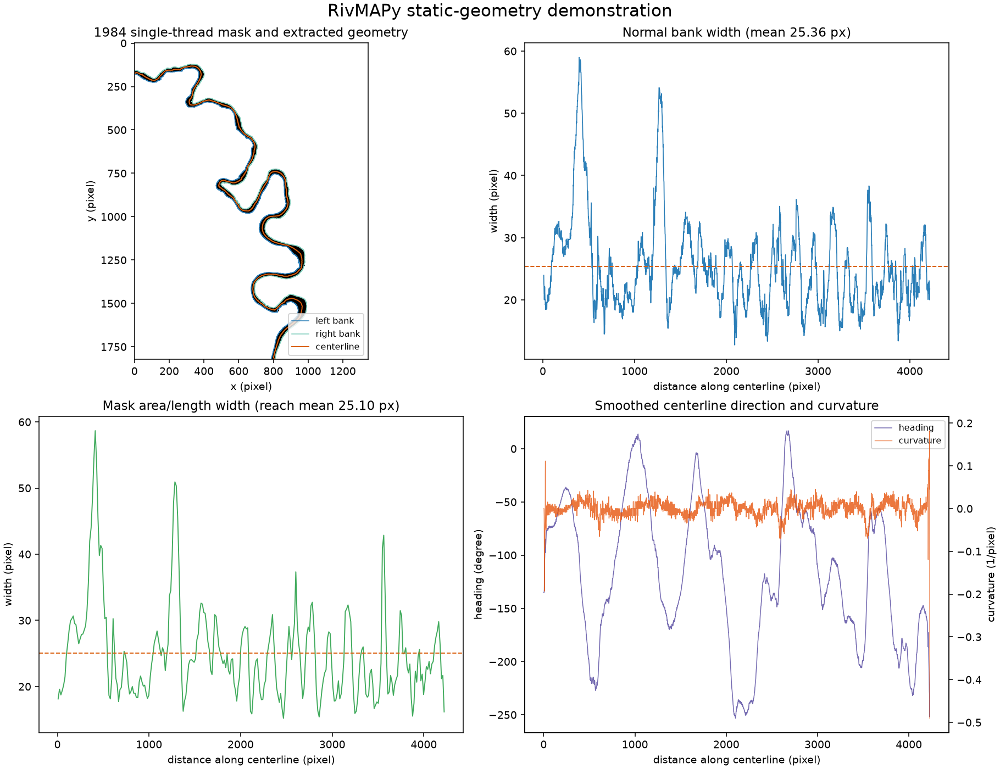
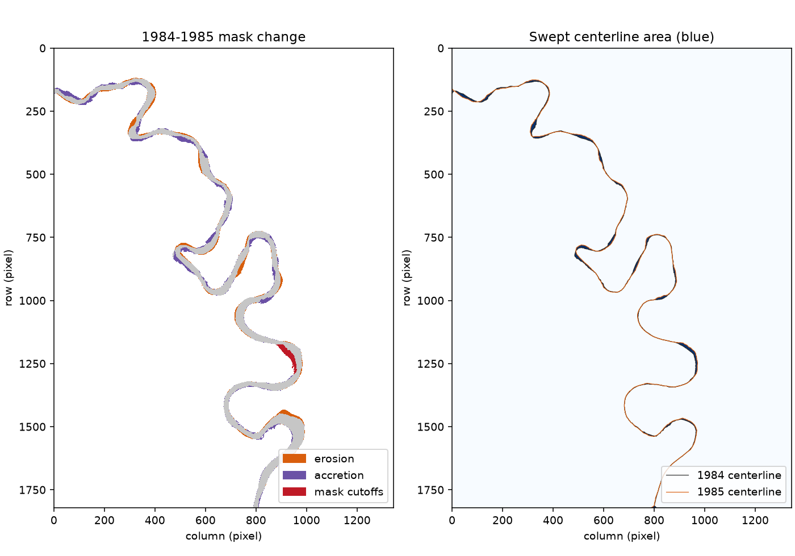
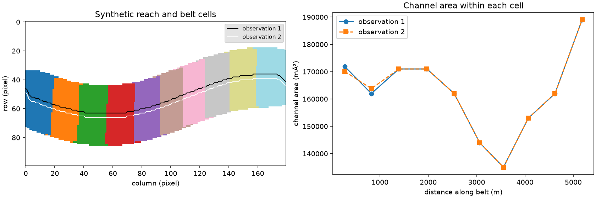

# RivMAPy: an end-to-end walkthrough

This guide follows three workflows: real Ucayali masks to channel geometry,
two observations to river change, and georeferenced masks to spatial summaries
and GIS files. No MATLAB or Jupyter installation is needed.

The Python blocks below run **in order in one Python session or script**, from
the repository root. They read the bundled data without changing it and write
only to `examples/output/walkthrough/`. Rerunning replaces this walkthrough's
generated outputs. The embedded figures are saved previews from a verified run;
your run regenerates them in that output directory.

All nine Python blocks were executed together on Windows with Python 3.12 on
2026-09-06, taking about 33 seconds on the development machine. This excludes
installation and the optional full-period temporal run; timings will vary.

## Quick start

In an activated Python 3.10+ environment, from the repository root:

```console
python -m pip install -e ".[examples,geospatial]"
```

If you just want to see results before reading the code, the existing scripts
run the same types of analyses:

```console
python examples/static_geometry.py
python examples/multiyear_change.py --maximum-records 5 --output examples/output/multiyear_quick.png
python examples/georeferenced_workflow.py
```

The first two use real Ucayali masks. The third creates a small synthetic test
reach with known georeferencing. The five-record run is a quick check, not the
full historical result. To follow the step-by-step version, start here:

```python
from pathlib import Path
import os
import numpy as np

ROOT = Path.cwd()
assert (ROOT / "data" / "riv.mat").is_file(), "Start in the repository root."
OUT = ROOT / "examples" / "output" / "walkthrough"
OUT.mkdir(parents=True, exist_ok=True)
os.environ.setdefault("MPLCONFIGDIR", str(OUT / ".matplotlib"))

import matplotlib
matplotlib.use("Agg")  # Save figures without requiring a desktop display.
import matplotlib.pyplot as plt

from rivmapy import (
    load_rivmap_mat, centerline_from_mask, banklines_from_mask,
    width_from_banklines, width_from_mask, smooth_polyline, angles, curvatures,
    migration_mask, migration_centerlines, channel_belt_from_masks,
    spatial_changes, crop_to_mask, read_mask, read_geotiff, read_geopackage,
)
```

## 1. Real masks to centerlines, banks, and widths

The distributed `riv.mat` contains 32 annual records, 1984–2015. Use the
prepared **single-thread** mask for this example. The upstream/downstream exit
sides and nominal width come from the record; `"SW"` means south to west.

```python
records = load_rivmap_mat(ROOT / "data" / "riv.mat")
record = records[0]
mask = record.mask("single_thread")
cl = centerline_from_mask(mask, record.exit_sides, record.nominal_width)
banks = banklines_from_mask(mask, record.exit_sides)

# Width at centerline vertices, measured by normal intersections with banks.
bank_width = width_from_banklines(
    cl.coordinates, banks.left, banks.right, record.nominal_width,
)
# Segment-average channel area divided by segment centerline length.
area_width = width_from_mask(
    mask, cl.coordinates, spacing=record.nominal_width / 2,
)
length_px = np.linalg.norm(np.diff(cl.coordinates, axis=0), axis=1).sum()
reach_width_px = mask.sum() / length_px
smoothed = smooth_polyline(cl.coordinates, record.nominal_width)
heading = angles(smoothed)
curvature = curvatures(smoothed)

print(f"{len(records)} records: {records[0].year}-{records[-1].year}")
print(f"mask: {mask.shape}; flow: {record.exit_sides}")
print(f"centerline: {length_px:.2f} px")
print(f"reach area/length width: {reach_width_px:.2f} px")
print(f"mean bank-intersection width: {np.nanmean(bank_width):.2f} px")
```

Expected rounded results:

```text
32 records: 1984-2015
mask: (1823, 1345); flow: SW
centerline: 4228.79 px
reach area/length width: 25.10 px
mean bank-intersection width: 25.36 px
```

Coordinates are zero-based `(column, row)` pixel centers, ordered downstream.
Left/right banks are named looking downstream. Widths and lengths are in
pixels, heading in radians, and curvature in inverse pixels. Unresolved bank
intersections are `NaN`, which is why the summary uses `nanmean`.

The whole-reach area/length ratio is not the arithmetic mean of all segment
widths, and the two width methods need not agree at every bend. Use the
existing example's plotting helper to inspect the geometry and profiles:

```python
from examples.static_geometry import create_figure

fig, diagnostics = create_figure(
    record, mask, cl, banks, bank_width, area_width, heading, curvature,
)
fig.savefig(OUT / "ucayali_geometry.png", dpi=140)
plt.close(fig)
```



## 2. Two observations to erosion, accretion, and migration

Compare 1984 with 1985. `migration_mask` classifies changed channel pixels;
`migration_centerlines` measures swept centerline area and detects neck
cutoffs. They answer related but different questions.

```python
next_record = records[1]
next_mask = next_record.mask("single_thread")
next_cl = centerline_from_mask(
    next_mask, next_record.exit_sides, next_record.nominal_width,
)
change = migration_mask(mask, next_mask, record.nominal_width)
swept = migration_centerlines(
    cl.coordinates, next_cl.coordinates, mask.shape, record.nominal_width,
    exit_sides_t1=record.exit_sides, exit_sides_t2=next_record.exit_sides,
)

# The historical demonstration uses 30 m square pixels. This is a scale
# assumption, not a recovered CRS or map origin for these MATLAB arrays.
pixel_size_m = 30.0
km2_per_pixel = pixel_size_m**2 / 1_000_000
elapsed_years = next_record.year - record.year
migration_m_per_year = (
    swept.migrated.sum() / length_px * pixel_size_m / elapsed_years
)
print(f"interval: {record.year}-{next_record.year}")
print(f"erosion: {change.erosion.sum() * km2_per_pixel:.3f} km2")
print(f"accretion: {change.accretion.sum() * km2_per_pixel:.3f} km2")
print(f"mask-cutoff area: {change.cutoffs.sum() * km2_per_pixel:.3f} km2")
print(f"centerline cutoff events: {len(swept.cutoff_area)}")
print(f"area/length migration: {migration_m_per_year:.2f} m/yr")

# Every observed pixel belongs to exactly one mask-change class.
classes = np.stack([change.erosion, change.accretion, change.unchanged, change.cutoffs])
assert np.all(classes.sum(axis=0) == 1)
assert not np.any(swept.migrated & swept.cutoffs)
```

Expected rounded results for this interval:

```text
interval: 1984-1985
erosion: 8.600 km2
accretion: 12.573 km2
mask-cutoff area: 2.167 km2
centerline cutoff events: 0
area/length migration: 85.11 m/yr
```

New channel occupancy is **land erosion**; abandoned channel is **land
accretion**, except for pixels classified separately as cutoffs. `unchanged`
includes persistent land as well as persistent channel. A mask-derived cutoff
region and a centerline-derived cutoff event are not interchangeable.
Here the default mask rule classifies abandoned components larger than
`2 * nominal_width**2` as cutoffs, while the centerline method detects no neck
cutoff. Treat the mask label as a threshold-based classification, not an
independently confirmed neck-cutoff event.

The migration summary above is swept area divided by the older centerline
length and elapsed time. It is not a map of local bank-normal displacement.
Plot both classifications to see what was measured:

```python
from matplotlib.patches import Patch

rgb = np.ones((*mask.shape, 3), dtype=np.float32)
rgb[mask & next_mask] = (0.78, 0.78, 0.78)
rgb[change.erosion] = (0.85, 0.37, 0.05)
rgb[change.accretion] = (0.42, 0.32, 0.65)
rgb[change.cutoffs] = (0.75, 0.10, 0.15)
fig, axes = plt.subplots(1, 2, figsize=(10, 7), constrained_layout=True)
axes[0].imshow(rgb, interpolation="nearest")
axes[0].set_title("1984-1985 mask change")
axes[0].legend(handles=[
    Patch(color=(0.85, 0.37, 0.05), label="erosion"),
    Patch(color=(0.42, 0.32, 0.65), label="accretion"),
    Patch(color=(0.75, 0.10, 0.15), label="mask cutoffs"),
], loc="lower right")
axes[1].imshow(swept.migrated, cmap="Blues", interpolation="nearest", vmin=0, vmax=1)
axes[1].plot(*cl.coordinates.T, color="#252525", lw=0.6, label="1984 centerline")
axes[1].plot(*next_cl.coordinates.T, color="#d95f0e", lw=0.6, label="1985 centerline")
axes[1].set_title("Swept centerline area (blue)")
axes[1].legend(loc="lower right")
for ax in axes:
    ax.set(xlabel="column (pixel)", ylabel="row (pixel)")
fig.savefig(OUT / "ucayali_change.png", dpi=140)
plt.close(fig)
```



### Optional: the full historical time series

The existing temporal script repeats these analyses across all 32 dates:

```console
python examples/multiyear_change.py
```

It writes `examples/output/multiyear_change.png`. The previously validated full
run reports six definite centerline-cutoff events, 102.00 km² cumulative
erosion minus accretion, and 72.97 m/yr mean area/length migration at 30 m pixel
size. Allow a few minutes for the full-resolution run. These are full-period
results, not targets for the one-interval or five-record examples.

See [validation](validation.md) for tolerances, interpretation, and the
distinction between the six detected events and the legacy walkthrough's
seventh, spatially overprinted event. Validation uses sanity checks and legacy
reference results, not a fresh MATLAB run or exact pixel parity.

## 3. Georeferenced masks to a channel belt and GIS outputs

Use a separate, small synthetic reach to demonstrate georeferencing without
inventing a map origin for the Ucayali arrays. The fixture helper creates two
100-by-180 masks on a 30 m UTM grid (`EPSG:32718`), with a nodata margin.
For real data, replace these two input paths with your aligned GeoTIFF masks
and choose the appropriate flow exits and nominal width.

```python
from examples.georeferenced_workflow import synthetic_inputs

GEO = OUT / "georeferenced"
GEO.mkdir(parents=True, exist_ok=True)
path_a, path_b = synthetic_inputs(GEO)
first, second = read_mask(path_a), read_mask(path_b)
first.grid.assert_aligned(second.grid)
geo_cl_a = centerline_from_mask(first, "WE", nominal_width=10)
geo_cl_b = centerline_from_mask(second, "WE", nominal_width=10)
geo_banks = banklines_from_mask(first, "WE")
geo_widths = width_from_banklines(geo_cl_a, geo_banks, nominal_width=10)
geo_change = migration_mask(first, second, nominal_width=10)

belt = channel_belt_from_masks(
    [first, second], "WE", nominal_width=10, spacing=20,
    dilation_factor=1.5, smoothing_factor=4, padding_factor=4,
)
summary = spatial_changes(belt, [first, second], [geo_cl_a, geo_cl_b])
area_m2 = summary.channel_area * summary.grid.pixel_area
distance_m = belt.midpoint_distances * belt.grid.pixel_size
print(f"CRS: {first.crs}; observed pixels: {first.valid_mask.sum()}")
print(f"belt cells: {len(belt.cell_masks)}; area table: {area_m2.shape}")
assert not np.any(belt.cell_masks.sum(axis=0) > 1)
np.testing.assert_array_equal(belt.cell_masks.any(axis=0), belt.envelope)
np.testing.assert_array_equal(
    summary.channel_area.sum(axis=0),
    [(observation.binary_array() & summary.grid.valid).sum() for observation in (first, second)],
)
```

Expect 17,280 observed pixels, 10 belt cells, and an area table of shape
`(10, 2)`—one row per spatial cell and one column per observation. These small-
reach belt settings are explicit demonstration choices, not replacements for
the legacy defaults. Belt construction is sensitive to reach extent and
geometry; review the cells before interpreting spatial trends.

Unlike the bare-array workflow, these result objects carry a `grid`. Keep
passing the objects (or `result.raster("field")`) through spatial workflows;
extracting an array discards its connection to georeferencing. Areas here are
converted using the grid, and this particular CRS uses metres.

```python
cell_labels = np.zeros(first.grid.shape, dtype=int)
for index, cell in enumerate(belt.cell_masks):
    cell_labels[cell] = index + 1
fig, axes = plt.subplots(1, 2, figsize=(12, 4), constrained_layout=True)
axes[0].imshow(
    np.ma.masked_equal(cell_labels, 0), cmap="tab20", interpolation="nearest",
)
axes[0].plot(*geo_cl_a.coordinates.T, color="black", lw=1, label="observation 1")
axes[0].plot(*geo_cl_b.coordinates.T, color="white", lw=1, label="observation 2")
axes[0].set(title="Synthetic reach and belt cells", xlabel="column (pixel)", ylabel="row (pixel)")
axes[0].legend(loc="upper right", fontsize=8, facecolor="#dddddd")
axes[1].plot(distance_m, area_m2[:, 0], "o-", label="observation 1")
axes[1].plot(distance_m, area_m2[:, 1], "s--", label="observation 2")
axes[1].set(title="Channel area within each cell", xlabel="distance along belt (m)", ylabel="channel area (m²)")
axes[1].legend()
fig.savefig(OUT / "georeferenced_belt.png", dpi=140)
plt.close(fig)
```



### Export rasters, vectors, and width attributes

GeoTIFFs preserve CRS, transform, and observed-versus-nodata status. GeoPackage
vectors use map coordinates; width attributes must be converted separately.
Here the width samples include both pixel and metre values. Outputs use
explicit layer names to distinguish mask-derived cutoff regions.

```python
geo_cl_a.to_geotiff(GEO / "centerline.tif", overwrite=True)
for field in ("erosion", "accretion", "unchanged", "cutoffs"):
    geo_change.to_geotiff(GEO / f"mask_{field}.tif", field, overwrite=True)
belt.to_geotiff(GEO / "belt_envelope.tif", "envelope", overwrite=True)
cropped = crop_to_mask(first, "WE")
cropped.to_geotiff(GEO / "cropped_mask.tif", overwrite=True)

gpkg = GEO / "results.gpkg"
geo_cl_a.line().to_geopackage(gpkg, layer="centerline", overwrite=True)
for side in ("left", "right"):
    geo_banks.line(side).to_geopackage(gpkg, layer=f"{side}_bank", overwrite=True)
belt.polygons("cell_masks").to_geopackage(gpkg, layer="belt_cells", overwrite=True)
geo_change.polygons("cutoffs").to_geopackage(gpkg, layer="mask_cutoffs", overwrite=True)
properties = [
    {
        "width_px": float(w) if np.isfinite(w) else None,
        "width_m": float(w * first.grid.pixel_size) if np.isfinite(w) else None,
    }
    for w in geo_widths.widths
]
geo_widths.points(properties=properties).to_geopackage(
    gpkg, layer="bank_widths", overwrite=True,
)
```

Open the `.tif` files and `results.gpkg` in your GIS. The synthetic pair has
no mask cutoff, so an empty `mask_cutoffs` layer is expected. Nodata remains
distinct from valid zeros. The package does not silently reproject or align
different grids; prepare a common projected, square-pixel grid before
quantitative geometry analysis.

### Check the saved products

Rereading confirms the files—not just the in-memory objects—retain their
spatial information. Pixel-center coordinates need a half-pixel offset from
the affine pixel-corner origin; result export handles this automatically.

```python
saved = read_geotiff(GEO / "mask_erosion.tif")
geo_change.grid.assert_aligned(saved.grid)
np.testing.assert_array_equal(saved.valid_mask, geo_change.grid.valid)
np.testing.assert_array_equal(saved.array.astype(bool), geo_change.erosion)
saved_line = read_geopackage(gpkg, layer="centerline")
assert saved_line.crs == first.crs
np.testing.assert_allclose(
    saved_line.geometries[0].coords, geo_cl_a.world_coordinates(), rtol=0, atol=1e-8,
)
saved_crop = read_geotiff(GEO / "cropped_mask.tif")
np.testing.assert_allclose(
    saved_crop.grid.world_coordinates([[0, 0]]),
    first.grid.world_coordinates([[cropped.left, cropped.top]]), rtol=0, atol=1e-8,
)
saved_cells = read_geopackage(gpkg, layer="belt_cells")
expected_cells = [index for index, cell in enumerate(belt.cell_masks) if cell.any()]
assert [p["cell_index"] for p in saved_cells.properties] == expected_cells
saved_widths = read_geopackage(gpkg, layer="bank_widths")
expected = next(p["width_m"] for p in properties if p["width_m"] is not None)
actual = next(p["width_m"] for p in saved_widths.properties if p["width_m"] is not None)
assert np.isclose(actual, expected)
print(f"Verified CRS, grid, validity, crop offset, vector coordinates, and attributes: {GEO}")
```

For your own data, see the [georeferencing guide](georeferencing.md) for mask
encodings, nodata restrictions, mosaicking, units, and export behavior. The
[compatibility notes](legacy_behavior.md) explain intentional differences from
MATLAB. To run all automated checks, install `.[dev]` and run
`python -m pytest -q -p no:cacheprovider` from the repository root.

To refresh the embedded previews after an intentional algorithm change,
rerun these blocks, review the results, and copy the three generated PNGs
from `examples/output/walkthrough/` to `docs/assets/walkthrough/`.
